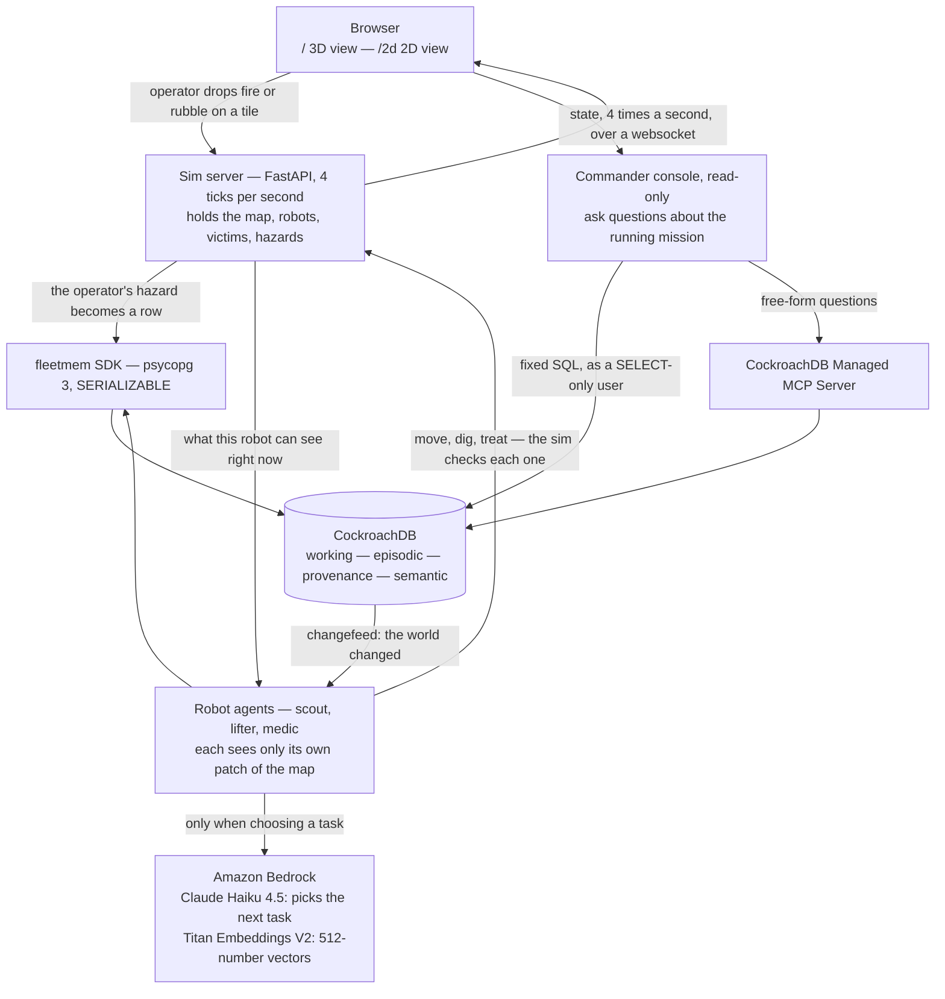

# project flock — a fleet that remembers together

*by bird labs* · <https://github.com/psamin/project_flock> · Apache 2.0

A team of simulated rescue robots — **scouts**, **lifters** and **medics** —
runs one disaster-relief mission together. Scouts search the map, lifters clear
debris, medics stabilise the people who are found.

**The robots never send each other messages.** There is no message queue and no
central dispatcher. Every robot reads and writes one CockroachDB cluster, and
that shared database is the only thing coordinating them. Because the
coordination lives in the database rather than in any one process, we can kill a
database node in the middle of a mission and the fleet keeps rescuing people.

Four kinds of memory, each stored in its own tables:

| Memory | Tables | What it holds |
|---|---|---|
| **Working** | `robots`, `tasks`, `victims`, `hazards` | what is true right now |
| **Episodic** | `observations` (512-dim `VECTOR`) | what we experienced |
| **Provenance** | `plans`, `events` | why we acted |
| **Semantic** | `mission_memories` (512-dim `VECTOR`) | what we learned across missions |

Start with [`colony/schema/v1_1.sql`](colony/schema/v1_1.sql). Its comments
explain why each table is shaped the way it is, not just what the columns are.

## Requirements

- **Docker** — CockroachDB v26.2.5 comes up from `colony/docker-compose.yml`
- **Python 3.12+** and [`uv`](https://docs.astral.sh/uv/) — deps are declared in
  [`colony/pyproject.toml`](colony/pyproject.toml) (FastAPI, uvicorn, psycopg 3;
  `boto3` is an optional extra)
- **No AWS credentials needed.** By default Bedrock replays recorded responses
  from a file in the repo, so a full mission runs offline. Credentials are only
  needed to call Claude live, and to ask the console free-form questions.

## Quickstart

```bash
git clone https://github.com/psamin/project_flock.git
cd project_flock/colony
make dev      # start CockroachDB v26.2.5 and create the tables
make sim      # run the simulation and serve it at http://localhost:8000
make test     # 926 tests
```

Asking the console free-form questions needs two more one-time steps, both
optional. Without them the console still answers its seven fixed questions,
which is what the demo mainly uses:

```bash
make skills          # fetch the CockroachDB Agent Skills repo (pinned)
make mcp-login       # authorise once in a browser; every later run is headless
make console-check   # is it wired up here? prints why not, if not
```

Two views of the same mission:

| URL | What it is | Needs |
|---|---|---|
| [`/`](http://localhost:8000/) | 3D view. Rotate and zoom the map, see each robot's sensor range, click a robot to read why it chose its current task. | WebGL 2 |
| [`/2d`](http://localhost:8000/2d) | 2D top-down view. Same information, drawn flat. Areas nobody has seen yet stay dark. | nothing |

These are two drawings of **one** simulation, not two simulations. Both read the
same `/ws` messages and show the same numbers, and both load `ui-shared.js` for
the panels they have in common. They are separate URLs rather than a toggle
because the 3D view needs WebGL and the 2D view does not: `/` checks for WebGL
*before* downloading 756 KB of Three.js, and sends any browser that cannot run
it to `/2d`. The older `/sim3d` URL still works, because our design notes and
video script refer to it.

`make sim` also runs with no database at all — it switches to an in-memory
store and says so on screen. Tests that need a real cluster skip themselves when
nothing is listening on port 26257, and CI treats those skips as a failure, so a
broken cluster cannot look like a passing build.

Other commands: `make demo` (reset, run one mission with no UI to learn from,
then serve a mission that uses those lessons), `make preflight` (check whether
everything needed to record the demo is working), `make cluster-3` and
`make cluster-3-kill` (start three database nodes, then kill one), `make smoke`
(confirm both views actually draw).

## Configuration

Everything has a working default; nothing below is required for the quickstart.

| Variable | Default | What it does |
|---|---|---|
| `COLONY_DSN` | `postgresql://root@localhost:26257/colony?sslmode=disable` | Cluster the fleet writes to |
| `COLONY_CONSOLE_DSN` | — | Console's separate identity (`commander`, SELECT-only) |
| `COLONY_MEMORY` | — | `fake` forces the in-memory store |
| `COLONY_BEDROCK_MODE` | `replay` | `live` · `record` · `replay` |
| `COLONY_BEDROCK_CASSETTE` | `colony/cassettes/golden-run.json` | Recorded Bedrock responses |
| `COLONY_MAP` | `colony/world/maps/aftershock.json` | The scenario to run |
| `COLONY_RECALL` | `1` | `0` disables semantic recall, for the contrast run |
| `COLONY_SKILLS_DIR` | `colony/skills/` | Where `make skills` fetched the Agent Skills repo |
| `CRDB_CLUSTER_ID` | — | Cloud cluster the MCP client passes to every call |
| `COLONY_MCP_TOKEN_PATH` | `~/.colony/mcp-token.json` | OAuth refresh token from `make mcp-login` |

Example configs and data live in the repo: `colony/docker-compose.yml`
(single node), `colony/docker-compose.deploy.yml` (one-command hosting),
[`infra/docker-compose.3node.yml`](infra/docker-compose.3node.yml) (chaos rig),
[`colony/world/maps/aftershock.json`](colony/world/maps/aftershock.json) (the
scenario), [`colony/cassettes/golden-run.json`](colony/cassettes/golden-run.json)
(recorded Bedrock responses).

Deeper setup — the 3-node chaos rig, per-robot credentials, live Bedrock,
CockroachDB Cloud — is in [`docs/setup-testing.md`](docs/setup-testing.md).
Hosting the demo is in [`docs/deploy.md`](docs/deploy.md).

## How it all fits together

Five parts. Each one has exactly one job.

| Part | What it does | Where |
|---|---|---|
| **Sim server** | Holds the real state of the world — the map, where every robot is, who is trapped, where the fire is. Advances it 4 times a second. | [`colony/sim/`](colony/sim/) |
| **Robot agents** | One loop per robot: scout, lifter, medic. Each one only ever sees its own small patch of the map. | [`colony/agents/`](colony/agents/) |
| **fleetmem SDK** | The only way a robot is allowed to touch the database. Seven functions, one connection pool. Its signatures are frozen, so other parts can be built against it. | [`colony/fleetmem/`](colony/fleetmem/) |
| **CockroachDB** | Every fact the fleet knows. This is where coordination actually happens. | [`colony/schema/`](colony/schema/) |
| **Amazon Bedrock** | Claude picks a robot's next task; Titan turns each observation into a 512-number vector so similar ones can be matched. | [`colony/bedrock/`](colony/bedrock/) |



### One robot picking one task, start to finish

This is the whole system in eight steps.

1. **The sim tells the robot what it can see.** Not the whole map — only the
   tiles within its own sensor range: 6 for a scout, 3 for a medic, 2 for a
   lifter. No robot is ever given the full picture.
2. **The robot writes down what it saw.** `report_observation` sends the sighting
   to Bedrock's Titan model, which returns 512 numbers describing it, and stores
   both in the `observations` table.
3. **Before storing, it checks whether this is already known.** In the same
   transaction, it vector-searches observations of the same kind within 5 tiles.
   A match updates the existing row and adds 1 to its sighting count; only a miss
   inserts a new one. This is why two scouts spotting one person produce one
   person, not two.
4. **The robot reads the shared task list.** `get_beliefs` returns open tasks,
   known victims and active hazards — written by *every* robot, not just this one.
   This is the moment one robot benefits from another's work.
5. **It decides what to do next.** The robot sends Claude a short summary of
   what it can see, plus lessons recalled from earlier missions. Claude replies
   with one of three choices — claim a specific task, explore a sector, or
   return to base — and a one-line reason. With no AWS credentials, built-in
   rules choose from the same three and the mission runs the same way.
6. **It claims the task.** One `UPDATE` succeeds only if the task is unclaimed
   or its previous owner's lease has run out. CockroachDB's `SERIALIZABLE`
   isolation means that if several robots go for the same task in the same
   instant, exactly one wins — with no lock, no queue and no coordinator.
7. **It records why.** The decision and the ids of the observations Claude was
   shown go into the `plans` table, so "why did m1 go there" is answered by
   reading rows, not by asking the model again.
8. **It keeps the claim alive.** The robot extends its lease every 5 seconds,
   and each extension is good for 15. If the robot dies, the lease runs out and
   step 6 lets any other robot take the task — nothing has to notice the death.

Then it repeats, 4 times a second, for every robot.

### The other three paths into the database

- **The operator** deliberately breaks the world — dropping fire or rubble on a
  tile. That command becomes a row in the `hazards` table, and a CockroachDB
  **changefeed** carries it to the robots. There is no other route in, so what
  the robots react to is exactly what the database says.
- **The commander console** answers questions about the running mission and can
  only read. Its two halves are read-only for different reasons; see
  [Tools](#tools) below.
- **The chaos rig** kills one of three CockroachDB nodes mid-mission
  ([`infra/`](infra/)). The fleet does not reconnect or retry differently; the
  cluster keeps serving and the mission continues.

### What deliberately has no owner

There is no allocator and no supervisor. Robots rank the open work and claim it
themselves; finishing a task unblocks the tasks that depended on it inside the
same transaction; a dead robot's work frees itself when its lease runs out. The
one job left over is telling the browser that a robot has gone quiet, which is
all [`colony/orchestrator/`](colony/orchestrator/) does.

A diagram showing where AWS and CockroachDB sit is in
[`docs/tools-and-services.md`](docs/tools-and-services.md#3-architecture).

## Four ideas worth reading the code for

**A claim is a lease, not a lock.** When a robot claims a task it stamps
`lease_expires_at` 15 seconds ahead and refreshes it every 5. The claiming
`UPDATE` accepts a task that is unclaimed **or** whose lease has run out, so a
dead robot's work becomes available on its own — there is no cleanup job, no
health checker and no recovery code anywhere. Under `SERIALIZABLE` isolation,
exactly one robot wins even when several go for the same task at the same
instant. Every
comparison uses the database's `now()`, so a robot with a wrong clock cannot
steal a task that is still held. See `claim_task` in
[`colony/fleetmem/client.py`](colony/fleetmem/client.py).

**Check for duplicates before storing, not after.** A new observation is
vector-searched against existing ones of the same kind within 5 tiles, inside
the same transaction that would insert it. A match updates that row and adds to
its sighting count; only a miss inserts. Two scouts spotting one trapped person
produce one record, so the fleet never sends two robots to the same place. The
5-tile limit is part of the SQL query, not applied to its results in Python —
filtering afterwards would drop real duplicates.

**Every decision keeps the evidence it was based on.** `plans.based_on` stores
the ids of the exact observation rows that were in the prompt. "Why did m1 go
there" is answered by joining two tables, so the answer is the actual input to
the decision rather than the model's later account of it.

**The fleet remembers tactics, not places.** When a mission ends, Claude reads
the results and writes down what would still be true next time — *"when a robot
has cleared debris to reach someone and no medic is there yet, send the medic
rather than keep exploring"* — and each lesson is stored in `mission_memories`
as 512 numbers. At the next decision, a vector search returns the lessons
learned in situations like this one. Lessons deliberately contain **no
coordinates**: the next disaster is not on the same tiles, and a fleet that
remembered where the victims were would already know the answer instead of
having to search for it.

## Repo map

| Path | What it is |
|---|---|
| [`colony/`](colony/) | The system. Its [README](colony/README.md) has the module-by-module map. |
| [`colony/schema/`](colony/schema/) | The tables for all four kinds of memory |
| [`colony/fleetmem/`](colony/fleetmem/) | The SDK every robot writes through, plus an in-memory fake |
| [`colony/agents/`](colony/agents/) | Scout, lifter, medic. Each runs the same loop: look, read the database, decide, act, write back |
| [`colony/bedrock/`](colony/bedrock/) | The Bedrock connection, in three modes: call AWS live, record the replies, or replay recorded ones |
| [`colony/sim/`](colony/sim/) | The real world state, the 4-times-a-second loop, and the websocket messages |
| [`colony/client/`](colony/client/) | Both views. `scene3d.js`+`rigs.js`+`director.js` draw the 3D view at `/`, `app.js`+`atlas.js` the 2D view at `/2d`, and `ui-shared.js` holds every panel they share |
| [`colony/console/`](colony/console/) | Both halves of the console, read-only: `questions.py` the seven fixed queries, `agent.py` the Claude+MCP agent, `mcp_client.py` the MCP connection, `skills.py` the Agent Skills loader |
| [`colony/orchestrator/`](colony/orchestrator/) | Marks a robot as lost, and an explanation of why it does nothing else |
| [`colony/tests/`](colony/tests/) | 926 tests |
| [`infra/`](infra/) | 3-node cluster, node-kill chaos rig, per-robot credentials, MCP config |
| [`audit/`](audit/) | The experiments behind every number, including three retracted findings |
| [`docs/`](docs/) | Setup, hosting, the tools writeup, and the changefeed investigation |
| [`PRD.md`](PRD.md) | The specification everything above cites by section |

## Tools

**CockroachDB** does five separate jobs here, and each one replaces code we would
otherwise have written:

| Feature | What it replaces |
|---|---|
| `SERIALIZABLE` isolation | a lock service or a task queue — robots claim work directly and the database picks the winner |
| Vector indexing (512-dim) | a separate vector database, for both duplicate-checking and recalling past lessons |
| `AS OF SYSTEM TIME` | a history table — the console can read what the fleet believed 30 seconds ago |
| Changefeeds | a message broker — an operator's hazard row reaches the robots on its own |
| Multi-node survival | a failover procedure — kill a node mid-mission and nothing stops |

Plus two tools the commander console uses at runtime: the **Managed MCP Server**,
which is how Claude reads the cluster when you type a free-form question, and the
**Agent Skills** repo, which Claude reads from when a skill matches what it is
doing.

The console has two halves, and they are read-only for genuinely different
reasons — worth separating, because stating it as one reason would be wrong:

| | connects as | what actually stops a write |
|---|---|---|
| fixed questions | `commander` | **the database grant.** This user has `SELECT` and nothing else, checked on the Cloud cluster by `credentials.py verify` |
| ask anything | `managed-mcp` | **our own limits.** Claude is handed read-only tools only, every statement is checked before it leaves our process, and the managed server refuses the rest |

That second row is a correction we made after calling the endpoint for real: MCP
does **not** inherit the `commander` grant, and the `CRDB_SQL_USER` key in the
published config snippet has no effect.

**Amazon Bedrock** runs Claude Haiku 4.5, which picks a robot's next task and
answers console questions, and Titan Text Embeddings V2, which turns each
observation and each lesson into 512 numbers. Claude is called only when a robot
needs a new task — never on every tick.

**A mission runs identically with no AWS credentials.** Built-in rules make the
same kind of choice, and every row in `plans` records whether Claude or the rules
decided it. So "an LLM is really driving this" is something you check with a
`SELECT`, not something we ask you to believe.

Full detail — what each tool does, what we deliberately did *not* use, measured
query plans at 50,000 rows, and our feedback to CockroachDB:
[`docs/tools-and-services.md`](docs/tools-and-services.md).

## Licence

Apache 2.0 — see [LICENSE](LICENSE).
