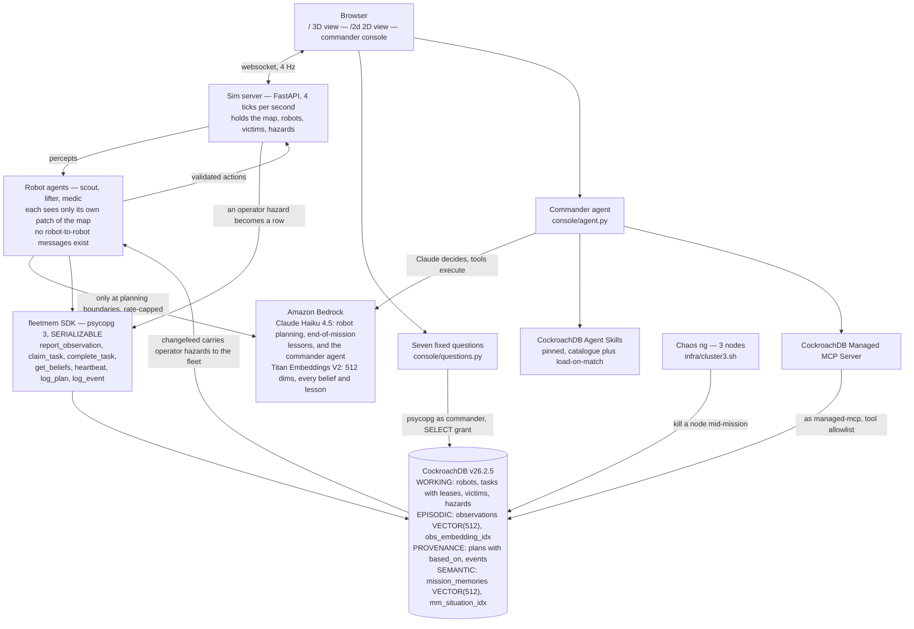

# project flock — tools and services

*What we used, and what the agent actually did with it.*

Submission answers for "which CockroachDB tools", "which AWS services", the
optional architecture diagram, and the optional feedback. Every claim points at
a file you can open. Where a named tool was **not** used, this says so.

- Repo: <https://github.com/psamin/project_flock> (public, Apache 2.0)
- Cluster: CockroachDB v26.2.5 — a Cloud cluster with the schema and
  least-privilege grants applied, plus a 3-node Docker rig for the chaos runs
- Suite: 926 tests, `make test`

---

## 1. CockroachDB tools

| Tool | Used | Where |
|---|---|---|
| **Distributed Vector Indexing** | ✅ used at runtime | [`colony/schema/v1_1.sql`](../colony/schema/v1_1.sql), [`colony/fleetmem/client.py`](../colony/fleetmem/client.py), [`colony/sim/recall.py`](../colony/sim/recall.py) |
| **Managed MCP Server** | ✅ used at runtime | [`colony/console/mcp_client.py`](../colony/console/mcp_client.py), [`colony/console/agent.py`](../colony/console/agent.py), [`infra/mcp.py`](../infra/mcp.py) |
| **Agent Skills** | ✅ used at runtime | [`colony/console/skills.py`](../colony/console/skills.py), [`colony/scripts/fetch_skills.sh`](../colony/scripts/fetch_skills.sh) |
| **ccloud CLI** | ❌ not used | — |

### Distributed vector indexing

Two vector indexes, declared inline in the DDL so the operator class travels
with the column:

```sql
VECTOR INDEX obs_embedding_idx  (mission_id, embedding vector_cosine_ops)  -- observations
VECTOR INDEX mm_situation_idx   (embedding vector_cosine_ops)              -- mission_memories
```

`vector_cosine_ops` is named explicitly. A bare `CREATE VECTOR INDEX (embedding)`
builds an L2 index, and a `<=>` query against it silently falls back to a scan —
so [`tests/test_schema.py`](../colony/tests/test_schema.py) asserts the operator
class is present in `SHOW CREATE`.

**What the agent actually does with them — two searches that scope in opposite
directions:**

| | scope | index | the agent's question | plan |
|---|---|---|---|---|
| **Reconcile gate** | within one mission | `obs_embedding_idx` | is this the victim I already know about? | **`FULL SCAN`**, deliberately |
| **Tactical recall** | across *every* mission and map | `mm_situation_idx` | what do we know about a moment like this? | **`vector search`** |

**Reconcile gate.** A scout sees something. It embeds the sighting with Titan,
then — *inside the same transaction that would insert it* — cosine-searches
existing beliefs of the same `kind` within a 5-tile box. A match merges and bumps
`sightings`; a miss inserts. Two scouts seeing one victim produce one victim, so
the fleet is never dispatched twice. The candidate filter is *in* the query, not
applied to its results: filtering a top-k in Python silently misses real
duplicates.

**Tactical recall.** When a mission ends, Claude reads its figures and derives
what would transfer — *"when a robot has cleared debris to reach a victim and a
medic is not yet present, bring the medic rather than continuing to explore"* —
and each lesson's **situation** is embedded into `mission_memories`. At the next
plan boundary a robot describes what it is facing, cosine search returns the top
3 tactics from situations like it, and those go into the planning prompt. This
index carries **no prefix column at all**, because any scope would partition
exactly the knowledge it exists to generalise.

Lessons are deliberately *not* where the victims were: the same disaster does not
recur on the same tiles, and a fleet recalling victim coordinates has been handed
the answer. The lesson prompt forbids coordinates outright and the digest it
reads is built without them.

**Measured at scale** ([`docs/scale.md`](scale.md), harness
[`audit/experiment_scale.py`](../audit/experiment_scale.py)) — 50,000
observations and 5,000 lessons, `ANALYZE`d, 25 timed runs each:

| query | rows | plan | p50 | p95 |
|---|---|---|---|---|
| Tactical recall — no prefix | 5,000 | **`vector search`** | 36.0 ms | 57.6 ms |
| Mission-scoped observations — prefix constrained | **50,000** | **`vector search`** | **21.3 ms** | 25.0 ms |
| Reconcile gate — the deliberate full scan | 50,000 | `FULL SCAN` | 426.0 ms | 577.5 ms |

**The gate does not use the index, and we would rather say so than have a judge
discover it.** It constrains `kind` and a position box beside the vector
order-by; neither is a prefix column of `obs_embedding_idx`, and v26.2 declines
to serve an approximate top-k it would then have to filter. `embedding IS NOT
NULL` disables it a second, independent time. Measured at 1047 rows with four
EXPLAINs isolating one clause at a time, so it is the query *shape*, not demo
scale.

We keep the scan. An approximate search that misses a duplicate sends two robots
to one victim — the exact bug the gate exists to prevent — and at mission scale
(~1000 beliefs) the scan is a few milliseconds. At 50k rows it is 20× slower and
would need a prefix redesign, not a filter move.
`test_the_reconcile_gate_query_uses_the_index` is kept as a **strict xfail** so
the gap stays visible and cannot regress into a pass nobody rechecked. Tests
assert `EXPLAIN` **plans** rather than results, because a wrong vector query
still returns perfectly plausible rows.

### Managed MCP Server

Two paths reach the managed endpoint, and only one of them runs during the demo.

**The editor path.** [`infra/mcp.py`](../infra/mcp.py) prints the config snippet
§6.2 describes — the one a teammate pastes into Claude Code, Cursor or VS Code:

```bash
uv run python ../infra/mcp.py config --cluster-id <id>
```

**The runtime path — what the agent actually does.** The commander console's
free-form tier ([`colony/console/agent.py`](../colony/console/agent.py)) is
Claude deciding and MCP executing. Ask it a question in the UI and Claude Haiku 4.5
runs a bounded tool loop (`MAX_TURNS = 8`) against
[`colony/console/mcp_client.py`](../colony/console/mcp_client.py), reading live
fleet memory through the managed server with a six-tool read allowlist:
`select_query`, `explain_query`, `get_table_schema`, `list_tables`,
`show_running_queries` and `show_statement`. So the tool is doing work *during
the demo*, not at development time.

**What we had to do to make the loop economical.** Left to itself the model
opened almost every question by guessing a column — `SELECT id, goal, status
FROM tasks` is the reasonable guess, and it is wrong, because a task's objective
is `kind` plus `target_x`/`target_y`. The endpoint refused it, the model then
called `get_table_schema` twice, and the operator watched a red ✕ scroll past
before any answer arrived. Two round trips and a visible error, for information
that never changes. The fix is to put all eight tables' columns in the system
prompt with the traps named out loud (*"there is no `goal`, `name`,
`description` or `position` column anywhere"*), so `get_table_schema` is now
what the agent calls to check an **index or a default** — not to look up a name
it should already have. That is the difference between a tool loop that answers
in one turn and one that answers in four.

Auth is OAuth 2.1. The endpoint advertises `authorization_code` and
`refresh_token` only — there is no `client_credentials` grant, so a server-side
process cannot mint a token from a secret. The shape that works is one human
login whose refresh token is then used headlessly, stored `0600` at
`~/.colony/mcp-token.json`, deliberately outside the repo so no `.gitignore` rule
stands between it and a commit. Scope requested is `mcp:read` alone.

**Three corrections we only found by calling it for real.** All three contradict
something this repo previously asserted, and they are recorded rather than
quietly fixed:

| what we believed | what the server does |
|---|---|
| MCP connects as `commander` and inherits its SELECT-only grant | it connects as **`managed-mcp`**, its own service identity — `SELECT current_user` says so, and the `CRDB_SQL_USER` key in the config snippet is **inert** |
| `readOnly: true` in the config is the access-control story | the server still *offers* `insert_rows`, `create_table` and `create_database` with it set |
| `?cluster=<id>` in the URL selects the cluster | it is not read; the id must be passed as a tool **argument** or calls fail with "cluster_id not provided" |

So the console's two tiers are read-only for genuinely different reasons, and
describing them as one story would be wrong:

| tier | connects as | what stops a write |
|---|---|---|
| seven canned questions | `commander` | **the grant** — SELECT and nothing else, asserted on the Cloud cluster by `credentials.py verify` |
| ask anything | `managed-mcp` | the six-tool **allowlist** the agent is handed, `assert_read_only` on every statement before it leaves the process, and the server's own refusals |

The allowlist matters precisely because the third layer is somebody else's: the
write tools the endpoint exposes are never in the tool list Bedrock sees, so no
amount of prompting reaches them. `assert_read_only` is imported from
[`console/reader.py`](../colony/console/reader.py) rather than reimplemented, so
the two paths cannot drift about what counts as a read.

**The seven fixed questions still carry the demo.** Audited queries that
between them interrogate all four memory systems:

| question | memory | what it reads |
|---|---|---|
| `why_did_robot` | provenance | `plans` × `observations` through `based_on` |
| `aftershock_response` | provenance | what the fleet re-decided, and when |
| `unreached_victims` | working | `victims` × the task graph blocking them |
| `who_holds_what` | working | `tasks` × `robots`, and the lease on each |
| `what_do_we_know` | episodic | `observations`, merge count visible |
| `beliefs_30s_ago` | episodic | the same rows via **`AS OF SYSTEM TIME`** |
| `what_did_we_learn` | semantic | `mission_memories` — unscoped, on purpose |

`why_did_robot` is the one that matters: it answers with the rows that were in
the prompt, not with a plausible story about them. A fixed statement a judge can
read and re-run is a stronger artefact than a model improvising SQL on camera,
which is why the free-form tier sits *above* these rather than replacing them.

### Agent Skills

[`cockroachlabs/cockroachdb-skills`](https://github.com/cockroachlabs/cockroachdb-skills)
is loaded the way the agentskills.io shape intends — two-tier, not pasted into a
prompt ([`colony/console/skills.py`](../colony/console/skills.py)):

- **`catalog()`** — every skill's `name` + `description` from its `SKILL.md`
  frontmatter, ~100 tokens each. This goes in the system prompt, and it is all
  the agent gets for free.
- **`load(name)`** — the full body, exposed to Bedrock as a **tool call**, and
  fetched only when the agent decides a description matches what it is doing.

That is the difference between using the repo and citing it: a judge watching
the transcript sees the agent read the catalogue and *choose* `cockroachdb-sql`
before writing a query against an unfamiliar schema, or
`triaging-live-sql-activity` when asked what the cluster is doing — and the
choice is the model's, mid-question.

Bodies are head-trimmed at 6000 chars, because skills are written procedure-first
and reference-tables-after, and a commander answering "which robots are stuck"
does not need 25 KB of benchmark prose to do it.

`make skills` fetches them via
[`scripts/fetch_skills.sh`](../colony/scripts/fetch_skills.sh), **pinned to a
commit** rather than tracking main — the agent routes on these descriptions, so
an upstream edit would change which skill it picks mid-demo. They land in
`colony/skills/`, gitignored: 34 skills of third-party markdown do not belong in
this repo's diff, and a pinned script is a more honest record of the dependency
than a vendored copy. Everything degrades to an empty catalogue when the
directory is absent, so a checkout that never ran the fetch still serves the
console — it just answers without skills and says so.

### ccloud CLI — not used

Zero files. The Cloud cluster was created in the Cloud console, and per-robot SQL
users and grants are applied over SQL by `infra/credentials.py apply` rather than
through `ccloud`. It is the one named tool we did not ship, and we are not
claiming it.

### CockroachDB features used beyond the named tools

- **`SERIALIZABLE` isolation** is what makes decentralized claiming safe. There
  is no allocator: robots rank open work and claim it themselves in one
  `UPDATE ... WHERE (status='open' OR lease_expires_at < now()) RETURNING id`,
  and the database adjudicates. Exercised under real contention with
  `ThreadPoolExecutor` races in
  [`tests/test_claiming.py`](../colony/tests/test_claiming.py), with
  `retry_on_serialization_failure` around SQLSTATE 40001.
- **`AS OF SYSTEM TIME`** gives the console time travel over the fleet's memory
  with no snapshot table, audit copy, or event-sourcing replay.
- **Changefeeds** carry an operator intervention to the fleet: the command is a
  `hazards` row and the changefeed is the only path from it to the robots
  ([`colony/fleetmem/changefeed.py`](../colony/fleetmem/changefeed.py)).
- **Multi-node survival.** Three nodes, kill one mid-rescue: zero tasks lost, no
  stall, rehearsed 5/5 ([`audit/x5-node-kill.md`](../audit/x5-node-kill.md)).

---

## 2. AWS services

| Service | Used | How |
|---|---|---|
| **Amazon Bedrock** — Titan Text Embeddings V2 (`amazon.titan-embed-text-v2:0`) | ✅ | Every observation and every learned lesson, at **512 dims** — both vector paths above are Titan vectors |
| **Amazon Bedrock** — Claude Haiku 4.5 (`us.anthropic.claude-haiku-4-5-20251001-v1:0`) | ✅ | Plan-boundary decisions, end-of-mission lesson derivation, and the commander agent's tool loop — via a cross-region inference profile |
| **Amazon EC2** | documented | Free-tier `t3.micro` is the hosting path in [`docs/deploy.md`](deploy.md) — the app container idles at 45 MiB, so the database is what needs the RAM |
| AWS Lambda | ❌ | Not used — the fleet is one long-lived tick loop, not request/response |
| Amazon S3 | ❌ | Not used — the map and the cassette are committed files |

**What the agent does with Bedrock.** At a plan boundary — task selection,
replan-on-aftershock, conflict resolution, never per tick — a robot builds a
digest of *its own local slice* of memory plus the tactics recall returned, and
asks Claude for strict JSON: `{task_id | explore(sector) | return_to_base,
rationale}`. The rationale becomes the thought bubble in the UI and the row in
`plans`. Global state is never in the prompt, because a robot that can read
everything is not solving the problem we set.

**Rules are not a fallback — they are a complete second implementation.** A mission runs identically with no AWS
credentials at all, and `plans.chosen.source` records `bedrock` or `rules` per
decision — so *"the LLM is driving this"* is checkable in SQL rather than
asserted. In a full mission, 15 of 36 decisions are Bedrock's.

**Discipline in [`colony/bedrock/adapter.py`](../colony/bedrock/adapter.py):**

- **Three modes** — `live`, `record`, `replay`. Seeded demo runs replay a
  committed cassette, which is what makes a demo reproducible *and* lets the
  public deployment show real Claude output with **no AWS credential on the box**.
- **`boto3` is an optional extra**, lazily imported. The demo runs with the AWS
  SDK not installed at all.
- **Transient vs. fatal is classified, not blanket-caught.** Throttling, quota
  and timeouts fall back to rules; `AccessDeniedException`,
  `ValidationException` and `ResourceNotFoundException` surface — treating a
  broken IAM policy as a transient blip would mean shipping an AWS integration
  that never once called AWS while looking perfectly healthy.
- **Rate cap** of 4 plan calls per robot per minute
  ([`colony/agents/planning.py`](../colony/agents/planning.py)), with a separate
  smaller reserve for world-changed replans so ordinary planning cannot eat it.
- **Replay with an empty cassette is fatal** (`NoCassette`), because the
  alternative is hash-derived vectors filling a `VECTOR(512)` column that nobody
  can distinguish from Titan's afterwards.

**The commander agent's spend is bounded separately.** It runs on the same model
and is capped by `MAX_TURNS = 8` tool rounds and `MAX_FAILURES = 4`, and it sits
*outside* the per-robot planning cap — somebody typing in a console must not be
able to spend the tick loop's budget.

**Stated plainly:** the free-form tier is **off** on the public deployment. It
needs a live Bedrock loop, which a cassette cannot stand in for, and an MCP
refresh token — which would put a long-lived credential on a box sitting on the
public internet for a month. `/api/console/agent` reports which piece is missing
rather than the tier silently not being there. The canned tier answers for
everyone; the free-form tier is for the video and a judge's local run.

Region defaults to `us-east-1` (`AWS_REGION`); credentials come from the standard
boto3 chain.

---

## 3. Architecture

Robots talk **only** to CockroachDB. Bedrock is called **only** when a robot
needs a new task. Both halves of the console can read the cluster and neither can
write to it — the left half because of a database grant, the right half because
of a tool allowlist we control.



**Reading it in one pass.** The sim holds the world and hands each robot only
what that robot can see. The robot reports what it saw through `fleetmem`, which
is the only code path to the database. To choose its next task it reads the
shared task list — written by every robot — and asks Claude, then claims the task
with a single conditional `UPDATE` that CockroachDB adjudicates. The operator
breaks the world by inserting a `hazards` row, and a changefeed is the only way
that reaches the fleet. The console reads the same cluster two different ways and
can write through neither.

## 4. Feedback for CockroachDB

From things that cost us time, not from the docs.

**Vector index + non-prefix filters is the sharp edge.** The behaviour is correct
— declining an approximate top-k that would then be filtered is the safe choice —
but it is *silent*. The query returns plausible rows and the only signal is
`EXPLAIN`. We shipped a passing test against a query shape we were not running. A
planner hint, or an opt-in warning like *"vector index not used: non-prefix
filter on `kind`"*, would have saved us the most expensive misconception in this
build.

**`CREATE VECTOR INDEX` prefix semantics deserve a worked counter-example.** The
docs explain that prefix columns must be constrained to exact values. What is
missing is the case that bit us: an *additional* non-prefix predicate disabling
the index entirely rather than being applied after the top-k. A three-line "this
plan is a full scan, and here is why" example would carry it.

**A bare `CREATE VECTOR INDEX (embedding)` silently builds `vector_l2_ops`**, and
a `<=>` query against it falls back to a scan with no error. The operator class
being required-in-practice but optional-in-syntax is a trap worth a warning.

**The Managed MCP Server's identity is not the one the config snippet implies.**
The snippet carries a `CRDB_SQL_USER` key, which reads like the SQL identity the
server will use; it is inert, and the server connects as `managed-mcp`. We built
an access-control story on "MCP inherits the `commander` grant" and only found it
was wrong by running `SELECT current_user` through the endpoint. Either honouring
that key or documenting the service identity prominently would close a gap that
is easy to over-claim in exactly the direction a security reviewer cares about.

**There is no cheap "describe the whole database" call.** `get_table_schema`
is per-table, so an agent facing an unfamiliar schema either spends N round
trips or — as ours did — guesses and eats a refusal. We solved it by
hard-coding the schema into the system prompt, which works precisely because
ours is fixed and small; an agent pointed at a database it does not own cannot
do that. One `get_schema` returning every table's columns in one payload would
turn the most common opening move of every MCP agent from N calls into one.

**`readOnly: true` still advertises `insert_rows`, `create_table` and
`create_database`.** We expected the flag to shrink the tool list. Since it does
not, every agent built on this endpoint has to carry its own allowlist, and the
ones that do not will look read-only right up until a model decides otherwise.

**`?cluster=<id>` in the published URL is not read.** Calls fail with
"cluster_id not provided" until the id is passed as a tool argument. The snippet
in the Cloud console teaches the query-parameter form, so the first call anyone
makes from a copied config fails.

**No `client_credentials` grant means no clean server-side auth.** The endpoint
offers `authorization_code` and `refresh_token` only, so a headless process has
to be bootstrapped by a human browser login and then keep a refresh token on
disk. That is workable, and we ship it — but a service-account grant would let a
deployed agent authenticate without a long-lived credential sitting in a file.

**Serializable retry was a genuine non-event, and that is worth saying.** One
`retry_on_serialization_failure` decorator around 40001, and we never thought
about contention again with six agents claiming against shared rows at 4 Hz.
Coming from databases where this is a project, it was a day-one correctness win.

**Lease-in-the-`WHERE`-clause deserves to be a documented pattern.** Our entire
fault-tolerance story is one `UPDATE ... WHERE lease_expires_at < now() RETURNING
id`. We arrived at it ourselves; it is the single highest-leverage thing
CockroachDB let us *delete* — a watchdog, a sweeper, and a supervisor. We would
have adopted it on day one from a docs page called *"task queues without a
coordinator"*.

**v26.2 restricting `crdb_internal` and `system` broke our node-health check**
with a message that reads like a permissions bug rather than a deliberate policy.
`cockroach node status` was the answer; a pointer in the error text would have
shortened that from an hour to a minute.
